<div align="center">

```
$ whoami
```

<table>
<tr>
<td width="360" align="center">


</td>
<td width="360" align="center">


</td>
</tr>
</table>

```
$ cat contributions.log
```



</div>

---

<div align="center">

### how this is built

Every visual on this page is a hand-rolled, self-contained SVG — no third-party
stats badges, no embedded JavaScript. Animation comes entirely from
[SMIL](https://developer.mozilla.org/en-US/docs/Web/SVG/SVG_animation_with_SMIL)
(`<animate>` / `<animateTransform>`), which GitHub's sanitizer leaves alone,
and every style is a plain SVG presentation attribute rather than `<style>` or
`style="..."` (both of which GitHub strips from embedded SVGs).

| script | what it does |
| --- | --- |
| `scripts/prep_photo.py` | removes the background (`rembg`), boosts local contrast (CLAHE), composites on white |
| `scripts/make_ascii_svg.py` | converts the prepped photo into a ~100×53 monochrome ASCII grid that wipes in row by row |
| `scripts/make_info_card.py` | renders a neofetch-style panel whose lines fade + slide in on a stagger |
| `scripts/fetch_contributions.py` | scrapes the public `github.com/users/<user>/contributions` fragment and writes `data/contributions.json` |
| `scripts/render_heatmap_svg.py` | renders that JSON as a 53×7 heatmap with a diagonal slide-down reveal, legend, and stats footer |

The heatmap refreshes daily via
[`.github/workflows/update-profile-art.yml`](.github/workflows/update-profile-art.yml),
which re-scrapes contributions, re-renders the SVG, and commits the result
straight back to this repo.

</div>
